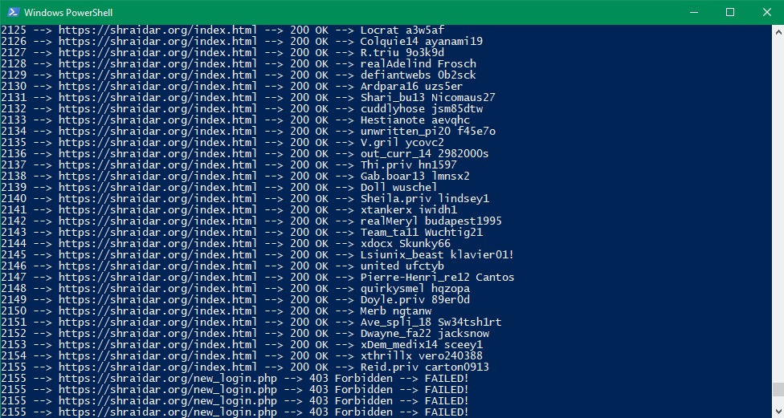
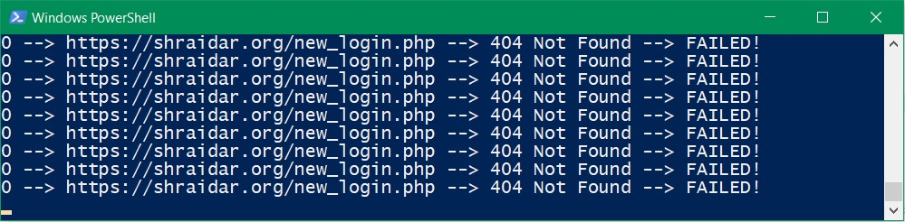

# toomanyphish
A little Python script that generates random username/password pairs
and sends them to the phishing website. The attacker will have it's database
littered with fake data and will eventually drop it or take the site offline.

Note that the username generator is optimized to produce instagram like usernames.
Structures for usernames can be customized [in the code](/toomanyphish.py#L60).

After sending thousands of fake usernames and password, the attacker blocked my IP address.
So it was kinda effective and potentially worked as intended.

Give this script to all your friends and let it run over night.
When you change your IP-Address every few minutes automatically (using tor i.e.),
the attackers can't do anything else than constantly blocking IP-Addresses or get their database flooded.

In my case the attackers took their site offline. Absolute win.
So they also don't get any more real userdata.
